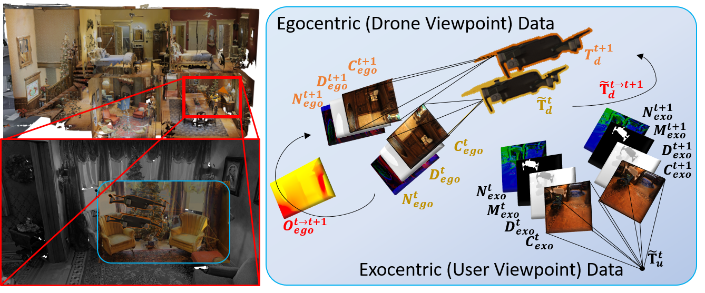
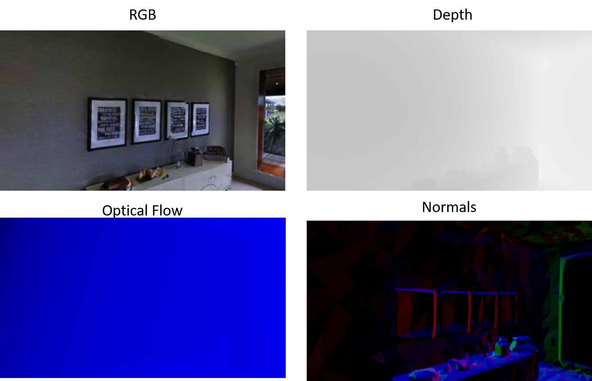
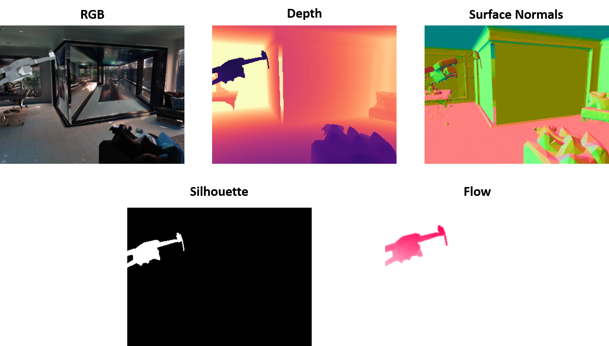

<h1 id="overview">Overview</h1>
 UAVA,<i>UAV-Assistant</i>,dataset is specifically designed for fostering applications which consider UAVs and humans as cooperative agents. We employ a real-world 3D scanned dataset (<a href="https://niessner.github.io/Matterport/">Matterport3D</a>
), physically-based shading, a gamified simulator for realistic drone navigation trajectory collection and randomized sampling, to generate multimodal data both from the user’s exocentric view of the drone, as well as the drone’s egocentric view
 

 
 

 <h1 id="motivation">Motivation</h1>
With the advent of low-cost commercial mini-UAVs, new applications and ways of interactions have emerged.
However, most of the existing UAV related dataset do not target such applications, prohibiting the development of data-driven methods.
Towards that end, we introduce UAVA a dataset designed for facilitating the development of such methods.
The dataset was create by leveraging an existing photorealistic dataset of indoor scenes, and by following a carefully designed gamification approach.

<h1>Trajectories</h1>
For collecting realistic and unbiased trajectories, we developed a game on <a href="https://unity.com/">Unity3D</a> and <a href="https://microsoft.github.io/AirSim/">AirSim</a>.
Collectible cube “coins” were placed at each of the known panorama positions (anchors) players were forced to navigate within the whole scene to collect the coins.
We record the drone's world pose among the scene at each time step.

<h1> Modalities </h1>
For the egocentric "UAV" view we generate colour images, depth, and surface maps, in addition to the optical flow for two consecutive frames <b>t, t + 1 </b> sampled from the dense play-through trajectories.
For the exocentric "user" view apart from the afforementioned modalities we generated and drone's silhouette images.
<h2> Samples </h2>
<table>
<tr>
<td>

</td>
</tr>
<tr>
<td>

</td>
</tr>
</table>

 <h1> Usage </h1>

 <h2> Download </h2>

We follow a <b>two-step</b> procedure to download the <b>UAVA</b> dataset.

 <h2> Data splits </h2>
 We follow the same data-split logic as defined in Matterport3D.

 <h1> Acknowledgements </h1>
 This dataset has been generated within the European Union’s Horizon 2020 innovation programme [FASTER](https://www.faster-project.eu/) under grant agreement No 833507.

 <table>
<tr>
<td>

</td>
<td>

</td>
</tr>
</table>
